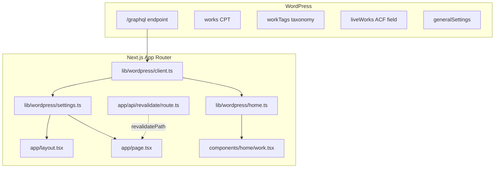

# Skill Creation Brief: Headless WordPress + Next.js

> **Instructions for Claude:** Convert this brief into a Cursor Agent Skill at `.cursor/skills/headless-wordpress-nextjs/SKILL.md`. Follow Cursor skill conventions: YAML frontmatter (`name`, `description`), under 500 lines, concise, third-person description with trigger terms, progressive disclosure if needed. Use this repo (`vladicamp-portfolio`) as the canonical reference implementation.

---

## Purpose

This brief documents a proven pattern for integrating **WordPress as a headless CMS** with **Next.js 16 App Router**. The reference implementation is a portfolio site where WordPress supplies site identity and portfolio items, while static marketing sections remain hardcoded in React.

Use this pattern when building or extending sites that need:
- WordPress as the content editor (non-developers manage content)
- Next.js as the frontend (performance, modern React, Vercel deployment)
- WPGraphQL for type-safe, efficient data fetching
- ISR caching with optional on-demand revalidation

---

## Proposed Skill Metadata

| Field | Value |
|-------|-------|
| **name** | `headless-wordpress-nextjs` |
| **location** | `.cursor/skills/headless-wordpress-nextjs/` (project skill) |
| **description** | Builds and extends headless WordPress + Next.js sites using WPGraphQL, Server Components, ISR, and on-demand revalidation. Use when the user mentions headless CMS, WordPress + Next.js, WPGraphQL, portfolio from WordPress, or migrating WordPress content to a Next.js frontend. |

---

## Architecture



### Key design decisions

1. **GraphQL only** — WPGraphQL endpoint; no REST (`wp-json`) usage
2. **Hybrid content model** — WP drives site settings + `works` portfolio; hero/services/about/contact are hardcoded React components
3. **Server Components only** — all WP fetches happen in async Server Components; no client-side SWR/React Query
4. **Layered lib structure** — one shared client, one file per content domain
5. **Graceful degradation** — settings fall back to hardcoded defaults; optional sections return empty arrays on failure

---

## File Layout Convention

```
lib/wordpress/
├── client.ts       # Shared fetchGraphQL<T>() wrapper
├── settings.ts     # Site identity (title, description, logo)
└── home.ts         # Domain queries (works CPT, helpers)

app/
├── layout.tsx      # generateMetadata() from WP settings
├── page.tsx        # Fetches settings, passes props to Header/Footer
└── api/revalidate/route.ts  # On-demand cache bust webhook

components/home/
└── work.tsx        # Async Server Component — fetches works independently

next.config.ts      # images.remotePatterns for WP uploads host
```

| File | Role |
|------|------|
| `lib/wordpress/client.ts` | Shared `fetchGraphQL<T>()` with `next: { revalidate: 60 }` |
| `lib/wordpress/settings.ts` | Site identity query + defaults + logo fallback |
| `lib/wordpress/home.ts` | Domain query per content type + TS interfaces + helpers |
| `app/api/revalidate/route.ts` | On-demand cache bust via `revalidatePath` |
| `next.config.ts` | `images.remotePatterns` for WP uploads host |

---

## Environment Variables

| Variable | Purpose | Required |
|----------|---------|----------|
| `NEXT_PUBLIC_WP_GRAPHQL_URL` | WPGraphQL endpoint (public, used in fetch) | No (has default) |
| `REVALIDATE_SECRET` | Auth for on-demand revalidation route | Yes in production |

Example `.env.local`:

```env
NEXT_PUBLIC_WP_GRAPHQL_URL=https://example.com/graphql
REVALIDATE_SECRET=your-random-secret-here
```

Never commit `.env*` files.

---

## WordPress-Side Requirements

### Required plugins

- **WPGraphQL** — exposes WordPress data via GraphQL
- **WPGraphQL for ACF** — if using Advanced Custom Fields (this repo uses ACF for `liveWorks`)

### Content model (reference implementation)

| WordPress concept | GraphQL field | Notes |
|-------------------|---------------|-------|
| Custom post type | `works.nodes[]` | Portfolio items |
| Custom taxonomy | `workTags.nodes[]` | Tech tags on works |
| ACF field group | `liveWorks.liveUrl` | External project URL |
| General settings | `generalSettings` | Site title, description, icon |
| Featured image | `featuredImage.node.sourceUrl` | Thumbnail for portfolio grid |

### GraphQL exposure

Ensure custom post types, taxonomies, and ACF fields are registered with `show_in_graphql => true` in WordPress.

### Optional: image size

This repo uses Divi Builder's registered size `ET_PB_POST_MAIN_IMAGE_FULLWIDTH`. Replace with a standard size (e.g. `LARGE`) or register a custom size in WordPress if Divi is not installed.

### Optional: revalidation webhook

Configure a WordPress webhook (on publish/update) to call:

```
POST https://your-nextjs-site.com/api/revalidate?secret=<REVALIDATE_SECRET>&path=/
```

---

## Code Templates

### 1. GraphQL client (`lib/wordpress/client.ts`)

```typescript
const WP_GRAPHQL_URL =
  process.env.NEXT_PUBLIC_WP_GRAPHQL_URL || 'https://example.com/graphql';

export async function fetchGraphQL<T>(
  query: string,
  variables?: Record<string, unknown>
): Promise<T> {
  const res = await fetch(WP_GRAPHQL_URL, {
    method: 'POST',
    headers: { 'Content-Type': 'application/json' },
    body: JSON.stringify({ query, variables }),
    next: { revalidate: 60 },
  });

  if (!res.ok) {
    throw new Error(`GraphQL request failed: ${res.status} ${res.statusText}`);
  }

  const json = await res.json();

  if (json.errors?.length) {
    throw new Error(
      `GraphQL errors: ${json.errors.map((e: { message: string }) => e.message).join(', ')}`
    );
  }

  return json.data as T;
}
```

### 2. Settings module (`lib/wordpress/settings.ts`)

Pattern: interface + GraphQL query + fetcher with try/catch defaults + helper functions.

```typescript
import { fetchGraphQL } from './client';

export interface WPGeneralSettings {
  title: string;
  description: string;
  siteIconUrl: string | null;
}

const DEFAULT_GENERAL_SETTINGS: WPGeneralSettings = {
  title: 'Site Title',
  description: 'Site description',
  siteIconUrl: null,
};

export const LOCAL_LOGO_FALLBACK = '/logo-fallback.avif';

const GET_GENERAL_SETTINGS = /* GraphQL */ `
  query GetGeneralSettings {
    generalSettings {
      title
      description
      siteIconUrl
    }
  }
`;

export async function getGeneralSettings(): Promise<WPGeneralSettings> {
  try {
    const data = await fetchGraphQL<{
      generalSettings: {
        title: string | null;
        description: string | null;
        siteIconUrl: string | null;
      };
    }>(GET_GENERAL_SETTINGS);

    return {
      title: data.generalSettings.title || DEFAULT_GENERAL_SETTINGS.title,
      description:
        data.generalSettings.description ||
        DEFAULT_GENERAL_SETTINGS.description,
      siteIconUrl: data.generalSettings.siteIconUrl || null,
    };
  } catch {
    return DEFAULT_GENERAL_SETTINGS;
  }
}

export function getSiteLogoSrc(settings: WPGeneralSettings): string {
  return settings.siteIconUrl ?? LOCAL_LOGO_FALLBACK;
}
```

### 3. Domain query module (`lib/wordpress/home.ts`)

Pattern: co-locate TypeScript interfaces, GraphQL query string, async fetcher, and small helper functions.

```typescript
import { fetchGraphQL } from './client';

export interface WPTerm {
  id: string;
  name: string;
  slug: string;
}

export interface WPWork {
  id: string;
  slug: string;
  title: string;
  featuredImage: {
    node: { sourceUrl: string };
  } | null;
  workTags: {
    nodes: WPTerm[];
  };
  liveWorks: {
    liveUrl?: string;
  } | null;
}

const GET_WORKS = /* GraphQL */ `
  query GetWorks {
    works {
      nodes {
        id
        slug
        title
        featuredImage {
          node {
            sourceUrl(size: LARGE)
          }
        }
        workTags {
          nodes {
            id
            name
            slug
          }
        }
        liveWorks {
          liveUrl
        }
      }
    }
  }
`;

export async function getWorks(): Promise<WPWork[]> {
  const data = await fetchGraphQL<{ works: { nodes: WPWork[] } }>(GET_WORKS);
  return data.works.nodes;
}

export function getWorkTechTags(work: WPWork): WPTerm[] {
  return work.workTags?.nodes ?? [];
}

export function getWorkThumbnail(work: WPWork): string | null {
  return work.featuredImage?.node?.sourceUrl ?? null;
}
```

### 4. Layout metadata (`app/layout.tsx`)

```typescript
import type { Metadata } from 'next';
import { getGeneralSettings } from '@/lib/wordpress/settings';

export async function generateMetadata(): Promise<Metadata> {
  const settings = await getGeneralSettings();

  return {
    title: settings.title,
    description: settings.description,
    icons: {
      icon: settings.siteIconUrl || '/favicon.ico',
    },
  };
}
```

### 5. Page orchestration (`app/page.tsx`)

Fetch WP data in the page, pass plain props to presentational components:

```typescript
import { getGeneralSettings, getSiteLogoSrc } from '@/lib/wordpress/settings';

export default async function Home() {
  const settings = await getGeneralSettings();
  const logoSrc = getSiteLogoSrc(settings);

  return (
    <>
      <Header logoSrc={logoSrc} siteTitle={settings.title} />
      <main>
        {/* Static sections — no WP fetch */}
        <Hero />
        <Services />
        {/* WP-driven section — fetches its own data */}
        <Work />
        <About />
      </main>
      <Footer logoSrc={logoSrc} siteTitle={settings.title} />
    </>
  );
}
```

### 6. Server Component with WP data (`components/home/work.tsx`)

```typescript
import { getWorks, getWorkTechTags, getWorkThumbnail } from '@/lib/wordpress/home';
import Image from 'next/image';

export default async function Work() {
  const works = await getWorks().catch(() => []);

  return (
    <section>
      {works.length === 0 ? (
        <p>No projects found.</p>
      ) : (
        works.map((work) => {
          const thumbUrl = getWorkThumbnail(work);
          const tags = getWorkTechTags(work);

          return (
            <article key={work.id}>
              {thumbUrl && (
                <Image
                  src={thumbUrl}
                  alt={work.title}
                  width={500}
                  height={500}
                />
              )}
              {/* WP titles may contain HTML entities — use dangerouslySetInnerHTML sparingly */}
              <div dangerouslySetInnerHTML={{ __html: work.title }} />
            </article>
          );
        })
      )}
    </section>
  );
}
```

### 7. Revalidation webhook (`app/api/revalidate/route.ts`)

```typescript
import { revalidatePath } from 'next/cache';
import { NextRequest, NextResponse } from 'next/server';

export async function POST(request: NextRequest) {
  const secret = request.nextUrl.searchParams.get('secret');
  const path = request.nextUrl.searchParams.get('path') || '/';

  if (secret !== process.env.REVALIDATE_SECRET) {
    return NextResponse.json({ error: 'Invalid secret' }, { status: 401 });
  }

  revalidatePath(path);
  return NextResponse.json({ revalidated: true, path });
}
```

### 8. Remote images config (`next.config.ts`)

```typescript
import type { NextConfig } from 'next';

const nextConfig: NextConfig = {
  images: {
    remotePatterns: [
      {
        protocol: 'https',
        hostname: 'example.com',
        pathname: '/wp-content/uploads/**',
      },
    ],
  },
};

export default nextConfig;
```

---

## Agent Workflow Checklist

When implementing or extending a headless WordPress + Next.js integration, follow this order:

```
Task Progress:
- [ ] Read node_modules/next/dist/docs/ before writing Next.js code (per AGENTS.md)
- [ ] Confirm WordPress has WPGraphQL + required CPTs/fields exposed
- [ ] Add lib/wordpress/client.ts if missing
- [ ] Create one query file per content domain (settings.ts, home.ts, etc.)
- [ ] Wire Server Components — fetch in layout/page/components
- [ ] Pass plain props to presentational components (Header, Footer)
- [ ] Configure next.config.ts remotePatterns for WP image host
- [ ] Add /api/revalidate route and document webhook setup
- [ ] Add env vars to .env.local; never commit .env*
- [ ] Handle errors: defaults for critical shell, empty arrays for optional sections
```

### Error handling strategy

| Function | Strategy | Rationale |
|----------|----------|-----------|
| `getGeneralSettings()` | try/catch → hardcoded defaults | Site must render even if WP is down |
| `getWorks()` | `.catch(() => [])` at component level | Portfolio is optional; show empty state |
| `fetchGraphQL()` | throw on HTTP/GraphQL errors | Let callers decide fallback strategy |

### Fetch deduplication note

`getGeneralSettings()` is called in both `layout.tsx` (metadata) and `page.tsx` (header/footer). Both share the same 60s ISR cache, so Next.js deduplicates within a single request.

---

## Extension Patterns

### Adding a new CMS-driven section

1. **WordPress first** — register CPT, taxonomy, or ACF fields with GraphQL exposure
2. **Create query module** — `lib/wordpress/<section>.ts` with interface, query, fetcher, helpers
3. **Convert component** — change hardcoded component to async Server Component
4. **Update image config** — if new image host, add to `remotePatterns`
5. **Test revalidation** — ensure webhook path covers new routes if needed

### Converting a hardcoded section to WP-driven

Before (static data in component):

```typescript
const services = [
  { title: 'Web Development', description: '...' },
];
```

After (WP fetch):

```typescript
// lib/wordpress/services.ts
export async function getServices(): Promise<WPService[]> { ... }

// components/home/services.tsx
export default async function Services() {
  const services = await getServices().catch(() => []);
  ...
}
```

---

## Known Gaps (Optional Enhancements)

This reference implementation does **not** include these features. Mention them in the skill as optional upgrades:

| Feature | Status | Notes |
|---------|--------|-------|
| Preview/draft mode | Not implemented | Would need `draftMode()` + authenticated GraphQL |
| GraphQL codegen | Not implemented | Types are hand-written; consider `@graphql-codegen` |
| `revalidateTag` / fetch tags | Not implemented | Uses path-based revalidation only |
| Authenticated GraphQL | Not implemented | Assumes public GraphQL endpoint |
| All sections from WP | Partial | Hero, services, about, contact are hardcoded |

---

## Reference Implementation Files

Canonical source in this repo:

| File | Purpose |
|------|---------|
| `lib/wordpress/client.ts` | GraphQL HTTP client |
| `lib/wordpress/settings.ts` | Site settings query |
| `lib/wordpress/home.ts` | Works CPT query |
| `app/layout.tsx` | WP-driven metadata |
| `app/page.tsx` | Page orchestration |
| `app/api/revalidate/route.ts` | Revalidation webhook |
| `components/home/work.tsx` | Portfolio grid (only WP-driven section) |
| `components/general/header.tsx` | Receives logo/title props |
| `components/general/footer.tsx` | Receives logo/title props |
| `next.config.ts` | Remote image patterns |

Hardcoded sections (not from WP): `hero.tsx`, `marquee.tsx`, `services.tsx`, `about.tsx`, `contact.tsx`, `testimonial.tsx`

---

## Tech Stack

- **Next.js** 16.2.0 (App Router)
- **React** 19.2.4
- **TypeScript** 5
- **Tailwind CSS** 4
- **WordPress** with WPGraphQL (hosted separately, e.g. vladicamp.com)

---

## Prompt to Generate the Skill

After reading this brief, create the skill with:

> Create `.cursor/skills/headless-wordpress-nextjs/SKILL.md` following Cursor skill conventions. Use the workflow checklist, code templates, and architecture from SKILL-BRIEF.md. Keep it under 500 lines. Include progressive disclosure — put detailed templates in a separate `reference.md` if needed.
